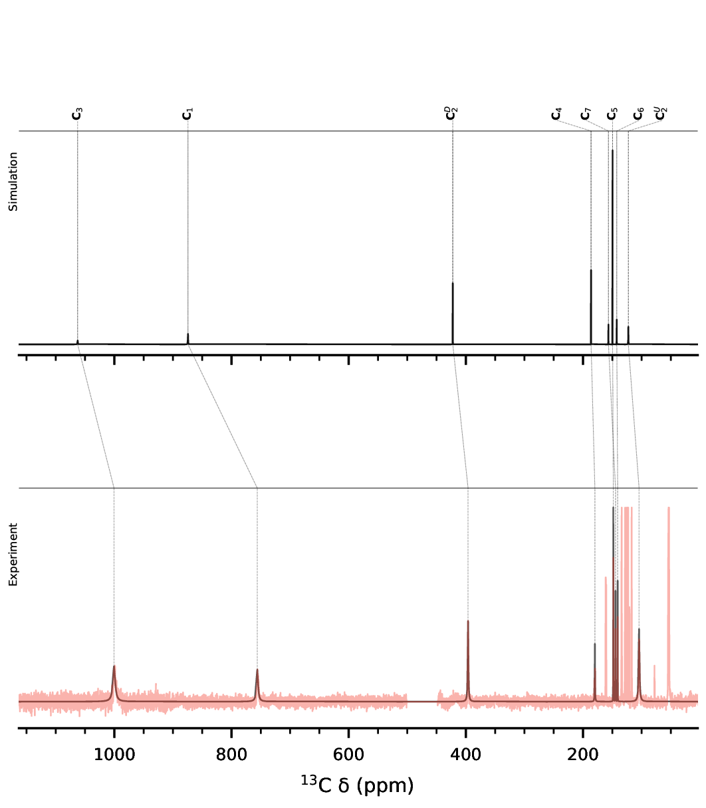

# SimpNMR-X

> **SimpNMR-X** is an independently maintained research and engineering fork of [SimpNMR](https://gitlab.com/suturina-group/simpnmr), developed by Ernest Borysenko as part of his PhD research. It has its own release cycle and engineering direction, with particular emphasis on stable pipelines, reproducible validation, and maintainable architecture. Mature, broadly useful changes may later be adapted and contributed upstream to SimpNMR.

[](https://mephistos-ml.github.io/simpnmr-x/)
[](https://github.com/Mephistos-ML/simpnmr-x/actions/workflows/ci.yml)
[](https://pypi.org/project/simpnmr-x/)
[](LICENSE)

**SimpNMR-X** is an open-source Python toolkit for prediction, fitting, and analysis of paramagnetic NMR spectra using experimental measurements and ab initio calculations. It provides a focused, reproducible environment for developing dependable workflows and validating new pNMR methods.

## Features

- Prediction of paramagnetic NMR shifts and spectra
- Susceptibility tensor fitting from experimental measurements
- Integration with quantum-chemistry outputs, including ORCA and Gaussian
- Experimental fitting and inference workflows
- Reproducible synthetic validation and acceptance testing
- Research-oriented development of new pNMR analysis methods

## Project relationship and authorship

SimpNMR-X complements SimpNMR. SimpNMR remains the upstream project for the shared scientific lineage and established citation record. Ernest Borysenko also contributes to the ongoing development and maintenance of SimpNMR, allowing mature work from this repository to be aligned with the upstream project where appropriate.

All original architecture, pipeline design, testing infrastructure, and engineering direction introduced in this fork are authored and maintained by Ernest Borysenko. This repository provides a focused and reproducible record of that work while remaining connected to the broader SimpNMR ecosystem.

## Installation

```bash
pip install simpnmr-x
simpnmr-x --help
```

SimpNMR-X requires Python 3.10 or newer.

The supported baseline is verified in CI on Python 3.10, 3.11, and 3.12.

## Quick example

```bash
simpnmr-x predict input.yml
```

## Demonstration

The P3FeCl example runs a complete prediction workflow from quantum-chemistry
outputs and produces a simulated-versus-experimental 13C spectrum:

```bash
cd examples/P3FeCl/SIMULATIONS/Prediction
simpnmr-x --hide predict P3FeCl_Prediction.yml
```



The generated figures and tabular results are written to
`P3FeCl_13C_Prediction/`.

## Documentation

SimpNMR-X documentation:

https://mephistos-ml.github.io/simpnmr-x/

Upstream SimpNMR documentation:

https://simpnmr.org/

## Project status

SimpNMR-X is research software with a production-minded engineering baseline. Core workflows are versioned and tested, while new methods may evolve as part of the PhD research programme. Breaking changes are documented in the changelog.

## Contributing

Development guidelines, architecture, testing conventions, and release policies are documented in the Developer Guide:

https://mephistos-ml.github.io/simpnmr-x/developer_guide/

Install the development dependencies and enable local pre-commit checks:

```bash
python -m pip install -e ".[dev]"
pre-commit install
```

Run all checks manually with:

```bash
pre-commit run --all-files
```

## Citation

If you use SimpNMR-X in academic work, please cite the software version used together with the relevant SimpNMR publication(s).

The original SimpNMR preprint is available on ChemRxiv:

https://doi.org/10.26434/chemrxiv.15001463.v1

Citation metadata for this repository is provided in [`CITATION.cff`](CITATION.cff).

## Support

Please use GitHub Issues for bug reports and feature requests.

For security vulnerabilities, follow the process described in [SECURITY.md](SECURITY.md).

Only the latest published release has a guaranteed security-support target; backports to older releases are discretionary.

## License

GPL-3.0-or-later. See [LICENSE](LICENSE).
